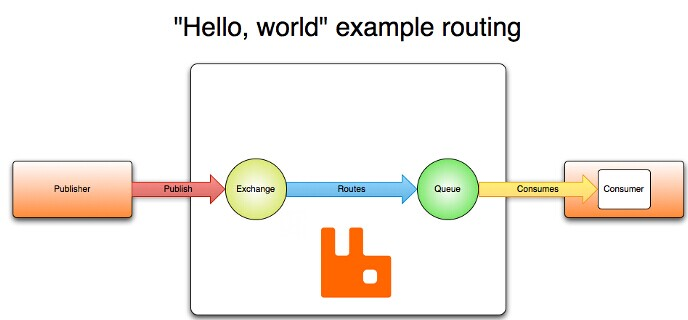
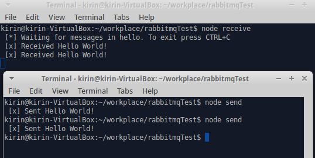

### 在Ubuntu上安装rabbitmq
---

#### 打开/etc/apt/sources.list，在最后加入

    deb http://www.rabbitmq.com/debian/ testing main

#### 加入公钥

    sudo wget https://www.rabbitmq.com/rabbitmq-signing-key-public.asc
    sudo apt-key add rabbitmq-signing-key-public.asc

#### 更新
    
    sudo apt-get update

#### 安装

    sudo apt-get install rabbitmq-server

#### 状态
    
    sudo rabbitmqctl status

#### RabbitMQ管理工具
    
    sudo rabbitmq-plugins enable rabbitmq_management
    
在浏览器输入`localhost:15672`进入管理界面，账号密码：guest/guest

<br/>

### RabbitMQ是一个消息代理。它的核心原理非常简单：接收和发送消息。
---

> 你可以把它想像成一个邮局：你把信件放入邮箱，邮递员就会把信件投递到你的收件人处。在这个比喻中，RabbitMQ是一个邮箱、邮局、邮递员。RabbitMQ和邮局的主要区别是，它处理的不是纸，而是接收、存储和发送二进制的数据——消息。



<br/>

### 利用Javascript方式使用rabbitmq
---

#### 本示例共6个部分，运行示例前请先`npm install`安装所需依赖

<br/>

#### "Hello World!" 
---
> The simplest thing that does something

##### 运行
程序位于HelloWorld，进入该目录后同一终端运行，或打开两个终端各自运行
```
node send
node receive
```



可以使用如下命令查看queue
```
rabbitmqctl list_queues
```

详细内容：http://www.rabbitmq.com/tutorials/tutorial-one-javascript.html

<br/>

#### Work Queues
---
> create a Work Queue that will be used to distribute time-consuming tasks among multiple workers.

程序位于WorkQueues，进入该目录后打开两个或多个终端各自运行
```
shell1$ node new_task.js First message...
shell2$ node worker.js
shell3$ node worker.js
```


#### 循环分发 Round-robin dispatching

> By default, RabbitMQ will send each message to the next consumer, in sequence. 
On average every consumer will get the same number of messages. 
This way of distributing messages is called round-robin.

分别启动两个worker
```
shell1$ node worker.js
shell2$ node worker.js
```

发送5条消息
```
shell3$ node new_task.js First message.
shell3$ node new_task.js Second message..
shell3$ node new_task.js Third message...
shell3$ node new_task.js Fourth message....
shell3$ node new_task.js Fifth message.....
```

两个worker会出现
```
shell1$ ./worker.js
 [*] Waiting for messages. To exit press CTRL+C
 [x] Received 'First message.'
 [x] Received 'Third message...'
 [x] Received 'Fifth message.....'
shell2$ ./worker.js
 [*] Waiting for messages. To exit press CTRL+C
 [x] Received 'Second message..'
 [x] Received 'Fourth message....'
```

<br/>

#### 消息确认 Message acknowledgment

> In order to make sure a message is never lost, RabbitMQ supports message acknowledgments. An ack(nowledgement) is sent back from the consumer to tell RabbitMQ that a particular message has been received, processed and that RabbitMQ is free to delete it.

> If a consumer dies (its channel is closed, connection is closed, or TCP connection is lost) without sending an ack,
RabbitMQ will understand that a message wasn't processed fully and will re-queue it. 
If there are other consumers online at the same time, it will then quickly redeliver it to another consumer. 
That way you can be sure that no message is lost, even if the workers occasionally die. 

In order to debug mistaking to miss the ack you can use rabbitmqctl to print the messages_unacknowledged field:

```
$ sudo rabbitmqctl list_queues name messages_ready messages_unacknowledged
Listing queues ...
hello    0       0
...done.
```

<br/>


#### 消息持久化 Message durability

> We have learned how to make sure that even if the consumer dies, the task isn't lost. 
But our tasks will still be lost if RabbitMQ server stops.

> When RabbitMQ quits or crashes it will forget the queues and messages unless you tell it not to. 
Two things are required to make sure that messages aren't lost: we need to mark both the queue and messages as durable.

```
ch.assertQueue('hello', {durable: true});
ch.sendToQueue(q, new Buffer(msg), {persistent: true});
```

<br/>

#### 公平分发 Fair dispatch

> You might have noticed that the dispatching still doesn't work exactly as we want. 
For example in a situation with two workers, when all odd messages are heavy and even messages are light,
one worker will be constantly busy and the other one will do hardly any work. Well,
RabbitMQ doesn't know anything about that and will still dispatch messages evenly.

> This happens because RabbitMQ just dispatches a message when the message enters the queue. 
It doesn't look at the number of unacknowledged messages for a consumer. 
It just blindly dispatches every n-th message to the n-th consumer.

```
ch.prefetch(1);
```

详细内容：http://www.rabbitmq.com/tutorials/tutorial-two-javascript.html


<br/>

#### Publish/Subscribe
---
> create a Work Queue that will be used to distribute time-consuming tasks among multiple workers.

程序位于PublishSubscribe，进入该目录后打开三个终端各自运行
```
shell1$ receive_logs
shell2$ receive_logs
shell3$ node emit_log [yourCommandParmaters]
```

当shell3发送message后，shell1与shell2都会接受到message

<br/>

#### Exchanges
In previous  
> A producer is a user application that sends messages.  
> A queue is a buffer that stores messages.  
> A consumer is a user application that receives messages.

And

> The core idea in the messaging model in RabbitMQ is that the producer never sends any messages directly to a queue.

> Instead, the producer can only send messages to an exchange. 
An exchange is a very simple thing. On one side it receives messages from producers and the other side it pushes them to queues. 


To list the exchanges on the server you can run the ever useful rabbitmqctl:

```
$ sudo rabbitmqctl list_exchanges
```

<br/>

#### Temporary queues

In the amqp.node client, when we supply queue name as an empty string, we create a non-durable queue with a generated name:
```
ch.assertQueue('', {exclusive: true});
```
When the connection that declared it closes, the queue will be deleted because it is declared as exclusive.

<br/>

#### Bindings

We've already created a fanout exchange and a queue. Now we need to tell the exchange to send messages to our queue. That relationship between exchange and a queue is called a binding.
```
ch.bindQueue(queue_name, 'logs', '');
```
From now on the logs exchange will append messages to our queue.


Listing bindings
```
You can list existing bindings using, you guessed it, rabbitmqctl list_bindings.
```

详细内容：http://www.rabbitmq.com/tutorials/tutorial-three-javascript.html

<br/>

#### Routing
---
> Receiving messages selectively

程序位于Routing，进入该目录后打开两个终端各自运行

```
shell1$ node receive_logs_direct warning
shell2$ node emit_log_direct warning 
```

#### Bindings

Bindings can take an extra binding key parameter (the empty string in the code above). 
This is how we could create a binding with a key:
```
ch.bindQueue(queue_name, exchange_name, 'black');
```
The meaning of a binding key depends on the exchange type.
The fanout exchanges, which we used previously, simply ignored its value.

<br/>

#### Direct exchange

> We were using a fanout exchange, which doesn't give us much flexibility - 
it's only capable of mindless broadcasting. 

> We will use a direct exchange instead. The routing algorithm behind a direct exchange is simple -
a message goes to the queues **whose binding key exactly matches the routing key of the message**.


Direct exchange X with two queues bound to it. The first queue is bound with binding key orange, and the second has two bindings,

In such a setup a message published to the exchange with a **routing key orange** will be routed to queue **Q1**. Messages with a **routing key of black or green** will go to **Q2**. 
All other messages will be discarded.

<br/>

#### Emitting logs

> Instead of fanout we'll send messages to a direct exchange. We will supply the log severity as **a routing key**. 
That way the receiving script will be able to **select the severity it wants to receive**.

```
var ex = 'direct_logs';

ch.assertExchange(ex, 'direct', {durable: false});
ch.publish(ex, severity, new Buffer(msg));
```

To simplify things we will assume that 'severity' can be one of 'info', 'warning', 'error'.

<br/>

#### Subscribing

Receiving messages will work just like in the previous tutorial, with one exception - we're going to create a new binding for each severity we're interested in.

```
args.forEach(function(severity) {
  ch.bindQueue(q.queue, ex, severity);
});

```

详细内容：http://www.rabbitmq.com/tutorials/tutorial-four-javascript.html

<br/>

#### Topics
---
> Receiving messages based on a pattern


### Topic exchange

> Messages sent to a topic exchange can't have an arbitrary routing_key - it must be a list of words, delimited by dots.

程序位于Topics，进入该目录后打开两个终端各自运行
```
shell1$ node receive_logs_topic "*.animal"
shell2$ node emit_log_topic.js "hello.animal"
```


> A few valid routing key examples: "stock.usd.nyse", "nyse.vmw", "quick.orange.rabbit"

there are two important special cases for binding keys:

* \* (star) can substitute for **exactly one word**.
* \# (hash) can substitute for **zero or more words**.


We created three bindings: Q1 is bound with binding key "*.orange.*" and Q2 with "*.*.rabbit" and "lazy.#".

A message with a routing key set to "quick.orange.rabbit" will be delivered to both queues. 
Message "lazy.orange.elephant" also will go to both of them. On the other hand "quick.orange.fox" will only go to the first queue,
and "lazy.brown.fox" only to the second. "lazy.pink.rabbit" will be delivered to the second queue only once, even though it matches two bindings. 
"quick.brown.fox" doesn't match any binding so it will be discarded.

On the other hand "lazy.orange.male.rabbit", even though it has four words, will match the last binding and will be delivered to the second queue.


详细内容：http://www.rabbitmq.com/tutorials/tutorial-five-javascript.html

<br/>

#### Remote procedure call (RPC)
---
> if we need to run a function on a remote computer and wait for the result? 
This pattern is commonly known as Remote Procedure Call or RPC.

程序位于RPC，进入该目录后打开两个终端各自运行
```
shell1$ node rpc_server
shell2$ node prc_client 30
```


#### Callback queue

> A client sends a request message and a server replies with a response message.

```
ch.sendToQueue('rpc_queue',new Buffer('10'), { replyTo: queue_name });
```

<br/>

#### Summary


Our RPC will work like this:

* When the Client starts up, it creates an anonymous exclusive callback queue.
* For an RPC request, the Client sends a message with two properties: reply_to, which is set to the callback queue and correlation_id, which is set to a unique value for every request.
* The request is sent to an rpc_queue queue.
* The RPC worker (aka: server) is waiting for requests on that queue. When a request appears, it does the job and sends a message with the result back to the Client, using the queue from the reply_to field.
* The client waits for data on the callback queue. When a message appears, it checks the correlation_id property. If it matches the value from the request it returns the response to the application.


详细内容：http://www.rabbitmq.com/tutorials/tutorial-six-javascript.html

---
中文参考：
* http://blog.csdn.net/anzhsoft/article/details/19570187
* http://blog.csdn.net/whycold/article/details/41119807
* http://www.cnblogs.com/dubing/p/4017613.html


